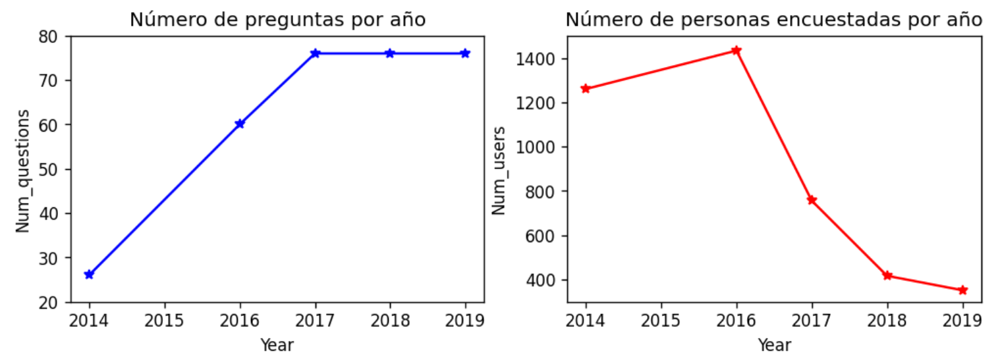
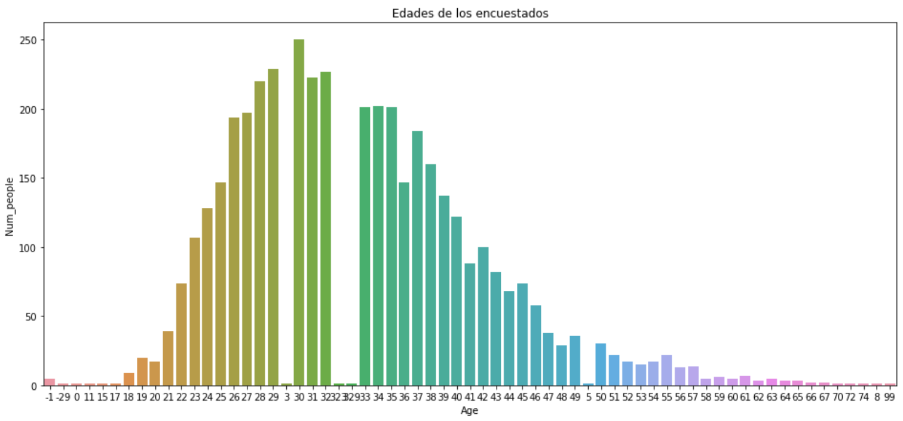
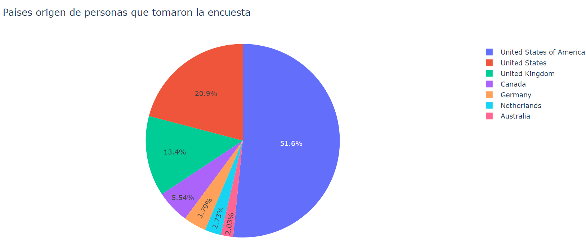
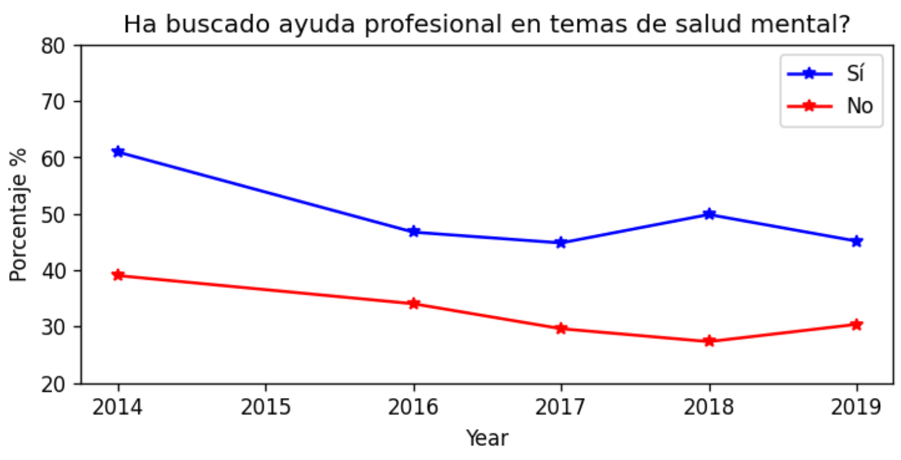
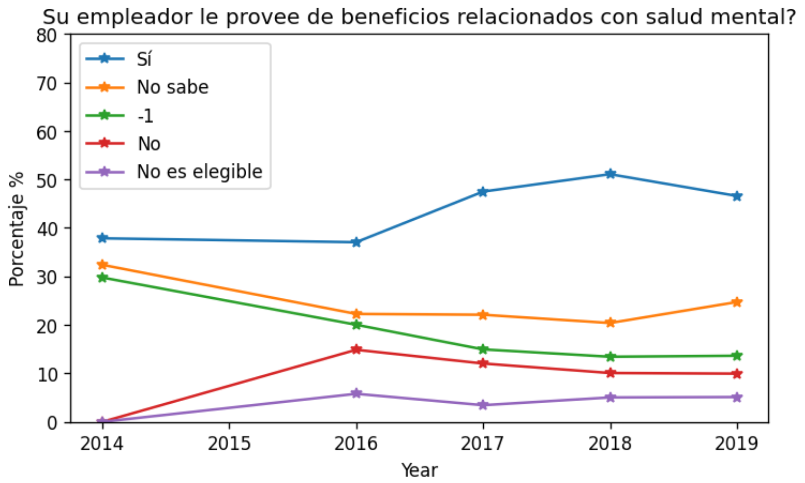

# Exploratory data analysis in mental health surveys

This is a project that tries to present an exploratory analysis on a database that contains information on mental health surveys filled by workers in the Tech industry, in such a way that populations at possible mental risks can be identified and companies in this economic sector take actions for the monitoring and treatment of its employees.

## About this project

The fulfillment of the above objective was done with the code contained in the folders, following the next order: 

* 1. Data_loading: The database file (.sqlite) is loaded from a web page and is manipulated with the sqlite3 library in Python, and a recognition of this data set is made to know their quality too.
* 2. Queries for analysis: Some of the questions contained in the surveys are analyzed in the files: [General_information.ipynb](https://github.com/cagutierrezgu/My_Portfolio/blob/321df20f749f8076e349f69b166f5ea17ffaf5fb/SQL%20for%20mental%20health%20data%20analysis/2.%20Queries%20for%20analysis/1.%20General_information.ipynb), [Deeper_questions.ipynb](https://github.com/cagutierrezgu/My_Portfolio/blob/321df20f749f8076e349f69b166f5ea17ffaf5fb/SQL%20for%20mental%20health%20data%20analysis/2.%20Queries%20for%20analysis/2.%20Deeper_questions.ipynb). All of this, in order to have a general idea of the population groups studied and help companies to take action in this matter.

## Models and results

One of the analysis made before starting to study the questions related with mental health, was the number of questions and people that took the survey along the years. The next figure shows that information

The graphs revealed an increase in the number of survey questions over the years, stabilizing since 2017. In addition, the number of surveyed people decreased significantly after 2016 and, despite the reason for which is unknown, could be attributed to the increase of the number of questions, as people may become discouraged by having to spend more time answering the questions. Even so, it is another fact that can influence the conclusions regarding the answers obtained.

Among the questions answered by the workers was their age, which can be an important information to take action in this matter. It was made a histogram to see the distribution of these ages

It is seen that the largest number of people is concentrated around 30 years of age, with an approximate deviation of 5 to 10 years. In addition, some values are poorly completed or processed in the database, such as negative ages.

Similar information to ages is the nationality or residence country of those people, and it is shown below

This lets us see that the United States, the United Kingdom and Canada are the countries that are most represented by the results of this survey, especially the first of these that is repeated in the first and second position. In addition, it could be indicating that said country has great potential in this industry.

On the other hand, it is important to analyze the results of the questions related to the mental health of people. For example, one of the questions states whether the individual has looked for professional help at some point in their life for mental health issues. These results are important, since if the answer is positive, it could indicate that the person may require help again now, or in the future. The answers are shown below

Over the years, people who have looked for professional help on this issue predominate over those who have not. This can give clues to companies and employers to go along with their workers and provide them with timely help.

Finally, another question analized was the next: does your employer provide you with benefits related to mental health? And here are the answers

These results show that a good percentage of workers can access services related to mental health, which is a positive aspect in controlling this issue. However, around a third or quarter of those surveyed state that they do not know about it, which represents a significant sector of those surveyed and should be improved with better communication of these services, if they exist. Likewise, there is a percentage close to 30% that says they do not have these benefits or are not eligible for them, which may improve over the years by employers in this industry.

## Conclusions

The most relevant findings seen in the analysis done are the following:

* An analysis of the database was done using SQL with the sqlite3 tool in Python, as well as the Pandas library for a better visualization of the results found after the queries made. In addition, libraries such as matplotlib, seaborn and plotly were very useful to make a variety of graphs of these results.
* The quality of the information in the tables was discussed by studying the number of answers and questions per year in each survey, as well as by viewing the answer options for some questions. Among the most relevant results, it was found that some of the questions had more answers per year than the number of people who had completed the survey that year, as well as an answer equal to '-1' for different questions without any meaning.
* The specific analysis of questions related to mental health revealed that the answers with the most votes were related to the knowledge and use of professional help in mental health issues, which is a positive point about it. Even so, there is still considerable ignorance and lack of coverage by many companies to provide benefits to their employees in this regard.
* The number of questions in all the surveys studied is more than 20, while here only a few of the available set were analyzed. Future studies may take into account a greater number of questions to obtain better conclusions, as well as study age groups more vulnerable to diseases of this type. On the other hand, you could consider the possibility of creating machine learning models using libraries like daskml, or directly on sklearn.
